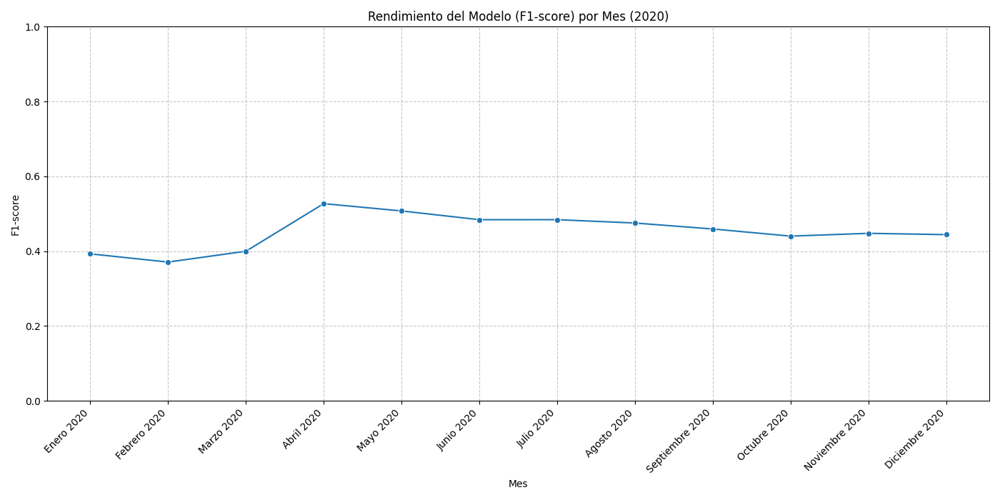

# Clasificador de Propinas para Viajes en Taxi en NYC (2020)

## Descripción del Proyecto
Este proyecto implementa un modelo de Machine Learning para predecir si un viaje en taxi en la ciudad de Nueva York recibirá una propina alta (mayor al 20% del costo del viaje). El modelo se entrena con datos de viajes de enero de 2020 y su rendimiento se evalúa a lo largo del año 2020 para comprender su robustez temporal.

---

## Estructura del Proyecto
El repositorio está organizado siguiendo un esquema profesional de ingeniería de software y ciencia de datos:

* `README.md`: Este archivo, que describe el proyecto y las instrucciones de ejecución.
* `requirements.txt`: Lista de todas las dependencias de Python necesarias para el proyecto.
* `data/`: Contiene los datos del proyecto.
    * `raw/`: Datos originales de los viajes de taxi descargados.
    * `processed/`: Datos transformados y preprocesados listos para el entrenamiento y la evaluación del modelo.
* `models/`: Almacena los modelos entrenados y serializados (ej. con `joblib`). Aquí se guardará el modelo `random_forest.joblib`.
* `notebooks/`: Contiene notebooks Jupyter/Colab utilizados para la exploración de datos, prototipado y validación. Aquí se encuentra el notebook original (`00_nyc_taxi_model.ipynb`).
* `src/`: Contiene el código fuente modularizado y reutilizable del proyecto.
    * `__init__.py`: Permite que `src` sea tratado como un paquete de Python.
    * `config.py`: Define parámetros y rutas de configuración para todo el proyecto, incluyendo URLs de datos y nombres de características.
    * `data/dataset.py`: Contiene funciones para la descarga, carga y preprocesamiento básico de los datos (limpieza y creación de la variable objetivo).
    * `features/build_features.py`: Incluye funciones para la ingeniería de características, es decir, la creación de variables predictoras a partir de los datos.
    * `modeling/`: Módulos relacionados con el entrenamiento y la predicción del modelo.
        * `train.py`: Script para el entrenamiento del modelo RandomForest.
        * `predict.py`: Script para la predicción y evaluación del modelo con métricas como F1-score.
    * `visualization/`:
        * `plots.py`: Contiene funciones para generar visualizaciones de los resultados de evaluación.
* `reports/`: (Se creará automáticamente) Directorio para guardar reportes y figuras generadas.
    * `figures/`: (Se creará automáticamente) Para guardar los gráficos de rendimiento.

---

## Cómo Ejecutar el Proyecto
Para replicar el análisis y la evaluación del modelo, sigue los siguientes pasos desde la raíz de este repositorio:

1.  **Clonar el Repositorio:**
    ```bash
    git clone [https://github.com/munsterinc1/nyc-taxi-tip-classifier/]
    cd nyc-taxi-tip-classifier
    ```

2.  **Crear y Activar un Entorno Virtual (Recomendado):**
    ```bash
    python -m venv venv
    # En Linux/macOS (o Git Bash en Windows):
    source venv/bin/activate
    # En Windows (CMD):
    .\venv\Scripts\activate
    # En Windows (PowerShell):
    .\venv\Scripts\Activate.ps1
    ```

3.  **Instalar Dependencias:**
    ```bash
    pip install -r requirements.txt
    ```
    *Nota: Si encuentras un error relacionado con `pyarrow` o `fastparquet`, asegúrate de que estas librerías estén instaladas. Puedes ejecutarlas individualmente si es necesario: `pip install pyarrow`.*

4.  **Entrenar el Modelo:**
    Este script cargará los datos de enero de 2020, preprocesará, entrenará el `RandomForestClassifier` y guardará el modelo serializado en `models/random_forest.joblib`.
    ```bash
    python -m src.modeling.train
    ```

5.  **Evaluar el Modelo Mensualmente y Generar Visualizaciones:**
    Este script cargará el modelo entrenado, evaluará su rendimiento (F1-score) en los datos de cada mes de 2020, mostrará una tabla resumen en la consola y generará un gráfico de rendimiento mensual que se guardará en `reports/figures/`.
    ```bash
    python -m src.modeling.predict
    ```
---

## Análisis del Comportamiento del Modelo a lo Largo del Tiempo

### Rendimiento Mensual del Modelo (F1-score)
--- Resumen de Resultados Mensuales ---
            mes  cantidad_ejemplos  f1_score
     Enero 2020            6382762  0.392794
   Febrero 2020            6276854  0.370875
     Marzo 2020            2995357  0.399728
     Abril 2020             236611  0.527001
      Mayo 2020             346612  0.507537
     Junio 2020             546843  0.484074
     Julio 2020             796346  0.484156
    Agosto 2020            1001832  0.475182
Septiembre 2020            1334414  0.459238
   Octubre 2020            1673052  0.440186
 Noviembre 2020            1501059  0.447669
 Diciembre 2020            1453523  0.444142

### Gráfico de Rendimiento



### Conclusiones

* **Rendimiento**
    No, el modelo no mantiene un rendimiento consistente. Se observa una caída importante en el F1-score a partir de marzo-abril de 2020, después de un rendimiento inicial pobre en el primer trimestre, que poseía una tendencia al alza.

* **Explicación del desempeño**
    
    La variación observada en el desempeño del modelo se explica principalmente por el contexto de la pandemia, ocurrida el año 2020 y el fenómeno del data drift.

    La Ciudad de Nueva York implementó varias medidas de confinamiento y restricciones de movilidad a partir de marzo de 2020. Esto alteró los patrones de vida, generando impactos en el uso del taxi. Hubo una una disminución de viajes motivados por el turismo y la actividad comercial. Los pocos viajes que se realizaron pudieron tener propósitos diferentes y rutas distintas a las habituales. Sumado a lo anterior, podemos ver que las horas puntas desaparecieron o se modificaron abruptamente. Como consecuencia de todo lo expuesto anteriormente, la situación económica y social durante la pandemia pudo haber influido en las propinas que los pasajeros daban a los conductores.

    El modelo fue entrenado con datos de enero de 2020. Estos datos representaban un comportamiento "pre-pandemia". Sin embargo, a medida que avanzaba el año, la distribución de las características de entrada (como la distancia del viaje) cambió radicalmente. El modelo, al no haber sido entrenado con estos nuevos patrones, pierde precisión al intentar hacer predicciones sobre ellos, lo que se manifiesta en la degradación de su F1-score.

    El "Peak" de abril es una anomalía que puede deberse al pequeño volumen. Es posible que la reducción en el número de viajes durante la pandemia hiciera que los pocos viajes restantes tuvieran características particulares, que por suerte el modelo lograra clasificar bien. Sin embargo, no fue un rendimiento sostenible, como se ve en los meses posteriores.

* **Acciones de mejora**

    Reentrenamiento periódico y el monitoreo continuo del rendimiento y el data drift.